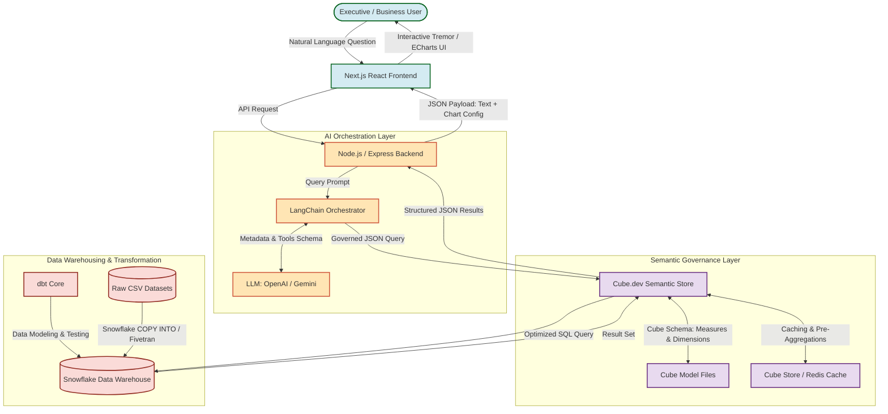

# MetricMind – Agentic Semantic BI Engine
## Project Overview & Architecture

MetricMind is an enterprise-grade Conversational Business Intelligence (BI) platform that democratizes data analytics. By acting as an intelligent orchestration layer, MetricMind translates natural language questions into governed business insights without exposing database credentials or risking SQL injection and hallucinations.

---

## 1. Project Introduction
Traditional Business Intelligence relies on rigid, pre-built dashboards or requires technical users to write SQL queries. This creates a bottleneck where business leaders must wait for data analysts to answer simple ad-hoc questions. 

**MetricMind** solves this problem by using Large Language Models (LLMs) to serve as a natural language interface for data. However, unlike traditional LLM-to-SQL setups—which are prone to SQL syntax errors, database schema mismatch, security breaches, and metric definition hallucinations—MetricMind utilizes an intermediate **Semantic Layer**. The LLM communicates exclusively with the Semantic Layer (Cube.dev), which enforces pre-defined, governed metrics and dimensions. Cube.dev then handles the translation to optimized SQL for execution on Snowflake, ensuring 100% accurate, consistent, and secure responses.

---

## 2. Business Problem & Proposed Solution

### The Business Problem
1. **Ad-Hoc Bottlenecks**: Analytics teams spend up to 70% of their time writing repetitive SQL queries for business managers.
2. **Hallucinated Calculations**: LLMs writing SQL directly to a database often calculate metrics (e.g., "Revenue", "Active Customers") inconsistently, using wrong filters or table joins.
3. **Data Security Risks**: Granting LLMs write/read permissions directly to a raw database exposes sensitive data and carries risk of SQL injection or server load crashes.
4. **Governance Fragmentation**: Different teams define key metrics (e.g., "Gross Margin") differently, leading to conflicting executive reports.

### The Proposed Solution: Semantic-First Agentic BI
MetricMind implements a strict separation of concerns:
```
[User Query] ➔ [LLM Orchestrator (LangChain)] ➔ [Semantic API (Cube)] ➔ [Data Warehouse (Snowflake)]
```
- The **LLM** translates the user's intent into a structured semantic query (selecting pre-defined measures and dimensions).
- The **Semantic Layer (Cube)** validates the request, checks cache layers, generates pre-compiled, optimized SQL, and runs it on the warehouse.
- **Snowflake** performs the computation over the enterprise data warehouse (Olist Brazilian E-Commerce dataset) and returns the result set.
- The **Frontend** presents the response through natural language synthesis and interactive, responsive analytical charts.

---

## 3. Key Objectives
- **Zero-SQL Business Interface**: Enable executive users to query data via simple conversational text.
- **Governed Metrics**: Guarantee that a metric like "Revenue" is calculated identically regardless of how the question is phrased.
- **Enterprise-Grade Security**: Ensure no raw database schema or credentials are ever exposed to the LLM agent or client-side application.
- **High Performance**: Leverage Cube's pre-aggregations and Snowflake's columnar scaling to keep query response times under 5 seconds.
- **Interactive Visualization**: Automatically select the optimal chart type (Bar, Line, Pie, Area, Table) based on the shape of the returned data.

---

## 4. Architecture Overview

The following diagram illustrates the end-to-end data flow and architectural components of the MetricMind system:



---

## 5. Technology Stack

| Layer | Technology | Role & Purpose |
| :--- | :--- | :--- |
| **Frontend UI** | Next.js (React), Tailwind CSS | Component-based, responsive web client providing standard search bar, chat interface, and dashboards. |
| **Data Viz** | Tremor / Apache ECharts | UI library for clean, reactive charts (bar, line, scatter, etc.) tailored for business metrics. |
| **Backend API** | Node.js, Express.js | Exposes endpoints to the frontend, manages user sessions, and coordinates requests with the AI layer. |
| **AI Orchestration**| LangChain, OpenAI / Gemini | Agent framework to parse query intent, match against semantic schemas, and format response texts. |
| **Semantic Layer** | Cube.dev (Cube Cloud/Self-hosted) | Translates logical queries into SQL, enforces access controls, and manages pre-aggregations/cache. |
| **Data Transformation**| dbt (data build tool) | Orchestrates SQL transformations, handles schema builds (Marts), and executes data quality tests. |
| **Data Warehouse** | Snowflake | Highly scalable cloud data warehouse storing raw e-commerce data and refined tables. |
| **Language & Tooling**| Python, SQL, JavaScript/TypeScript | General programming for ETL pipelines, database modeling, and frontend/backend implementations. |
| **Version Control** | Git, GitHub | Source control, pull request management, and CI/CD pipelines. |
| **Infrastructure** | Docker | Containerization of local development services (Backend, Frontend, Cube). |

---

## 6. Repository Structure

```
MetricMind-Agentic-Semantic-BI-Engine/
├── .github/                   # GitHub Actions workflows for CI/CD and automated testing
├── backend/                   # Node.js Express API service for coordination
│   ├── src/
│   │   ├── controllers/       # Route controllers (AI query handling, chat history)
│   │   ├── routes/            # Express route endpoints
│   │   └── services/          # Integration with LangChain and Cube.dev
│   ├── package.json
│   └── Dockerfile
├── cube/                      # Cube.dev semantic model definitions & configurations
│   ├── schema/                # YAML/JS schema files (Cubes, Measures, Dimensions)
│   └── cube.js                # Cube server configuration
├── datasets/                  # E-commerce datasets (Kaggle - Olist Brazilian Dataset)
│   └── raw/                   # Raw CSV datasets
├── dbt/                       # dbt project for SQL transformations in Snowflake
│   ├── models/                # staging (stg_), intermediate (int_), and mart (fct_, dim_) models
│   ├── tests/                 # Data validation tests (uniqueness, not-null, referential integrity)
│   └── dbt_project.yml
├── docker/                    # Docker Compose files for running local dev setups
├── docs/                      # Enterprise system documentation and dictionary files
├── frontend/                  # Next.js React application (Client-side)
│   ├── src/
│   │   ├── components/        # Chat components, dynamic chart wrapper, sidebar
│   │   └── pages/             # Routing and main application screens
│   ├── package.json
│   └── Dockerfile
├── scripts/                   # ETL and administrative Python/SQL scripts
└── snowflake/                 # Infrastructure-as-code scripts for Snowflake setup
    ├── database_setup.sql     # Database, warehouse, schema, and role definitions
    └── copy_commands.sql      # Data loading commands (COPY INTO) from S3/local to raw tables
```

---

## 7. High-Level Workflow

The execution of a conversational business query follows a structured, deterministic lifecycle:

```
[1] User Query: "Why did revenue decrease in Europe?"
     │
     ▼
[2] Next.js sends prompt payload to Node.js backend.
     │
     ▼
[3] Node.js calls LangChain Orchestrator.
     │
     ▼
[4] LangChain retrieves semantic model metadata from Cube.dev.
     │
     ▼
[5] Agent identifies dimensions (e.g. region, order_date) and measures (e.g. total_revenue).
     │
     ▼
[6] Agent structures Cube JSON Query (e.g. measures: ['orders.total_revenue'], dimensions: ['customers.region']).
     │
     ▼
[7] Cube.dev receives query, checks cache. If miss, generates Snowflake-optimized SQL with appropriate JOINs.
     │
     ▼
[8] Snowflake executes query on clustered warehouses, returns tabular data to Cube.dev.
     │
     ▼
[9] Cube.dev caches results, returns JSON payload to Node.js backend.
     │
     ▼
[10] LLM summarizes results in natural language; backend returns text summary + clean chart configuration.
     │
     ▼
[11] Next.js renders the text summary and interactive Tremor chart (e.g. Line Chart of Revenue).
```

---

## 8. Expected Deliverables & Outcomes
- **Production-grade Git Repository**: Clean, modular code divided into services.
- **Enterprise Documentation Suite**: Standardized guides for architectures, requirements, datasets, and schema definitions.
- **dbt Transformation Layer**: Well-structured dbt models in Snowflake transforming raw Olist data into governed star schema fact and dimension tables.
- **Governed Semantic Layer**: Multi-dimensional Cube schemas defining e-commerce metrics (GMV, order counts, average order values, delivery times).
- **Interactive Conversational UI**: Responsive dashboard application permitting speech/text query interfaces.

---

## 9. Team Responsibilities

- **Enterprise Data Architect**: Designs warehouse schemas, database sizing, concurrency clustering in Snowflake, and the overall system integration mapping.
- **Data Engineer**: Sets up ETL/ELT pipelines, builds dbt transformations, configures testing models, and sets up Snowflake roles/warehouses.
- **BI Engineer & Analytics Engineer**: Configures Cube.dev schemas, creates semantic metrics definitions, sets up pre-aggregations, and designs analytical dashboards.
- **Software/AI Engineer**: Implements frontend interfaces in Next.js, designs backend routes in Express, and builds the LangChain semantic query engine.

---

## 10. Development Methodology & Deployment
- **Methodology**: MetricMind is developed using Agile/Scrum. Sprints are 2 weeks long, culminating in demo showcases of conversational capabilities.
- **Deployment**: All services are containerized via Docker. Local environments spin up using Docker Compose. Production is targeted for AWS/GCP, deploying Snowflake as the cloud data warehouse, Cube Cloud for semantic query management, and Vercel/ECS for the web applications.
