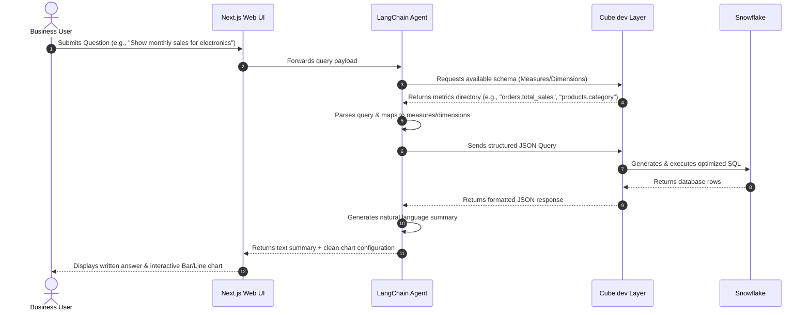

# MetricMind – Agentic Semantic BI Engine
## Business Requirements Document (BRD)

---

## 1. Executive Summary
In e-commerce operations, quick decision-making is critical to maintaining a competitive edge. Executives and operational managers need access to core business metrics regarding customer satisfaction, logistics speed, order values, and category performance. However, accessing this data traditionally requires either request queues to the central Business Intelligence (BI) team or writing manual SQL queries. 

**MetricMind** is designed to democratize access to Olist Brazilian E-Commerce data through natural language querying. By separating user intents from raw database SQL queries via an intermediate semantic governance layer (Cube.dev), the application delivers verified, accurate, and low-latency responses. Business users can query sales patterns, review scores, shipping margins, and delivery metrics directly in plain English, with results delivered as synthesized text and interactive, presentation-ready visualizations.

---

## 2. Business Goals & Objectives
- **Self-Service Accessibility**: Enable non-technical staff to extract data and answer ad-hoc questions independently, reducing basic query tickets by 85%.
- **Single Source of Truth (SSOT)**: Establish a unified semantic layer ensuring metrics like "Gross Merchandise Value" (GMV) or "Order Latency" are calculated consistently across all departments.
- **Improved Decision Latency**: Reduce the time-to-insight from hours or days (waiting for analyst reports) to under 5 seconds.
- **Enhanced Data Security**: Keep sensitive database credentials, tables, and internal schemas isolated from both LLM interfaces and client-side view states.

---

## 3. Business Challenges & Pain Points
- **Ad-Hoc Request Bottlenecks**: Data engineering teams are bogged down by simple, recurring requests (e.g., "What was our revenue in São Paulo last month?").
- **LLM Hallucinations**: Direct Text-to-SQL solutions generate incorrect tables, invalid joins, or invent fields that do not exist, leading to false reports.
- **Metric Proliferation**: Different spreadsheets define "Sales Value" differently (some include freight, some exclude cancelled orders), leading to inconsistent figures in board meetings.
- **Performance at Scale**: Querying multi-million-row raw databases like Olist geolocation tables can freeze traditional transactional servers if written inefficiently.

---

## 4. User Personas & Target Audience
- **Executive Leadership (CEO/CFO/COO)**: Requests high-level performance summaries, revenue by state, average margins, and sales trends.
- **Sales & Category Managers**: Monitors top-performing product categories, vendor performance, seller distribution, and category growth.
- **Logistics & Operations Leads**: Analyzes order delivery delays, carrier performance, shipping times versus estimates, and geographic shipping costs.
- **Customer Experience Managers**: Tracks review scores, customer sentiment in text reviews, and correlates low scores with delivery delays.

---

## 5. Stakeholders
- **Executive Sponsor**: VP of Business Intelligence & Data Analytics.
- **Data Engineering Lead**: Responsible for Snowflake schemas, pipelines, and dbt models.
- **BI Engineer & Modeler**: Responsible for Cube.dev metrics governing.
- **Frontend/Backend Developers**: Responsible for user experience, API routing, and AI orchestration.

---

## 6. Business Workflow

Below is the standard operational workflow for a business user interacting with MetricMind:

---

## 7. Functional Requirements

### FR-1: Natural Language Processing (NLP) Querying
- The system must parse complex natural language questions into structured queries.
- Supported operations include aggregations (Sum, Avg, Count), filters (by state, product category, date range), and ordering (Top N, Bottom N).
- The system must gracefully handle typos in cities or category names using fuzzy matching against semantic parameters.

### FR-2: Guided Governance (The Semantic Guardrail)
- The system **must never** pass raw SQL commands generated by an LLM to Snowflake.
- The system must map all requests to Cube.dev schema definitions.
- If a user asks a question requesting dimensions or metrics that do not exist (e.g., "Show employee salaries"), the agent must respond with a polite error stating it can only answer questions related to e-commerce metrics.

### FR-3: Responsive Analytical Visualizations
- The system must return structured data that is automatically rendered into an appropriate chart format (Tremor or Apache ECharts):
  - Time-series data ➔ Line or Area Chart.
  - Category comparison ➔ Bar or Column Chart.
  - Distribution metrics ➔ Pie or Donut Chart.
  - Tabular list ➔ Formatted Data Table.
- Users must be able to export charts as PNG images and tables as CSV downloads.

### FR-4: Contextual Conversational Threading
- The agent must maintain session context, allowing follow-up questions (e.g., Q1: "Show top categories." Q2: "Filter that for Rio de Janeiro.").

---

## 8. Non-Functional Requirements

### NFR-1: Performance & Latency
- The front-to-back roundtrip for a simple semantic query must resolve in `< 3.0` seconds under normal loads.
- Complex queries requiring heavy Snowflake aggregation must resolve in `< 5.0` seconds, utilizing Cube's pre-aggregations (rollup tables) and caching.

### NFR-2: Security & Isolation
- Database login credentials and internal table schemas must remain strictly hidden in backend environments.
- API endpoints connecting Backend -> Cube.dev and Backend -> OpenAI/Gemini must use encrypted SSL/TLS channels.

### NFR-3: Auditability & Logging
- Every user query, generated semantic payload, SQL executed by Cube, and model response time must be logged for system auditing and improvement analysis.

---

## 9. Business Rules
1. **Gross Revenue Calculation**: Gross Merchandise Value (GMV) is defined as the sum of order item prices. Freight cost is calculated and tracked separately.
2. **Order Completion Status**: For sales performance metrics, only orders with status `delivered`, `shipped`, or `invoiced` are counted. Cancelled or unavailable orders must be excluded unless explicitly queried.
3. **Date Anchoring**: If a query mentions a time frame (e.g., "this year" or "Q2 2018"), it must reference `order_purchase_timestamp` as the primary transaction date anchor.
4. **Geography Definition**: Customer locations are determined by the customer's state code, and seller locations by the seller's state code.

---

## 10. Key Performance Indicators (KPIs) & Success Metrics

The following metrics are defined inside the Snowflake data warehouse and exposed through the Semantic Layer:

| KPI Category | KPI Name | Definition / Formula | Business Value |
| :--- | :--- | :--- | :--- |
| **Sales** | GMV (Gross Merchandise Value) | `SUM(price)` of order items in valid statuses | Monitors raw sales volume and organizational growth. |
| **Sales** | Average Order Value (AOV) | `GMV / COUNT(DISTINCT order_id)` | Measures purchasing behavior and customer spend trends. |
| **Logistics** | Average Delivery Time | `AVG(order_delivered_customer_date - order_purchase_timestamp)` | Key operational metric to identify fulfillment bottlenecks. |
| **Logistics** | Order Latency (Delta Est.) | `AVG(order_delivered_customer_date - order_estimated_delivery_date)` | Identifies shipments delivered later than estimated (negative is good, positive indicates delay). |
| **Satisfaction**| Average Review Score | `AVG(review_score)` from 1.0 to 5.0 | Core tracker for customer satisfaction and service quality. |
| **Sales** | Product Revenue Share | `SUM(price) per category / Total GMV` | Evaluates product line popularity and guides stocking/seller policies. |

---

## 11. User Stories & Acceptance Criteria

### User Story 1: Conversational Sales Comparison
> **As an** E-Commerce Sales Director  
> **I want to** ask "Compare sales between housewares and health_beauty in 2017" in plain text  
> **So that** I can instantly see which category was more popular without requesting a dashboard.

#### Acceptance Criteria
- The system identifies "housewares" and "health_beauty" as product categories (dimensions) and maps them to `product_category_name_english` via translation tables.
- The system identifies "sales" as a measure and maps it to `total_sales` (GMV).
- The system filters data where `order_purchase_timestamp` falls in 2017.
- The system renders a bar chart comparing the two categories alongside a text summary.

### User Story 2: Logistics Delay Identification
> **As a** Shipping Operations Manager  
> **I want to** ask "Which states had the longest average delivery delays in 2018?"  
> **So that** I can renegotiate regional carrier contracts.

#### Acceptance Criteria
- The system aggregates average delivery delay (delivered date minus estimated delivery date, where difference is positive).
- The system groups the metrics by customer state (`customer_state`).
- The system filters transactions to the year 2018.
- The system returns the states ordered from longest delay to shortest and displays them on a bar chart.

---

## 12. Risks, Assumptions, & Constraints

### Risks
- **SQL Cost Volatility**: Frequent un-cached ad-hoc queries passing through Cube to Snowflake can cause auto-scaling warehouses to spin, raising database computation costs.
  - *Mitigation*: Enable Cube.dev pre-aggregations (rollups) and set reasonable Snowflake query timeouts.
- **Ambiguous Terminology**: User queries like "Which is the best product?" are subjective.
  - *Mitigation*: The LangChain agent must ask for clarification (e.g., "Do you mean by sales volume, rating, or order count?").

### Assumptions
- The database is updated via daily batch loads; queries represent data current as of the last nightly load.
- Users have standard modern web browsers supporting canvas rendering for interactive charts.

### Constraints
- The dataset is bounded chronologically between October 2016 and September 2018. Requests outside this period will return zero results.
- The language translation map (`product_category_name_translation.csv`) covers only 71 categories; Portuguese categories without translation will fall back to their raw Portuguese name.

---

## 13. Scope

### In Scope
- Text-based natural language questioning against Olist customer, order, payment, product, review, and seller tables.
- Cube.dev semantic model implementation matching metrics defined in the data dictionary.
- Next.js responsive web application displaying chat interfaces and dynamically rendering charts.
- Automatic routing of time-series, categorical, and tabular results to correct visual layouts.

### Out of Scope
- Direct write actions to Snowflake (no processing of INSERT, UPDATE, or DELETE via text).
- Real-time stream processing of orders.
- Custom authentication integrations (e.g., Okta/SAML) for this evaluation deployment version.

---

## 14. Business Glossary

- **GMV (Gross Merchandise Value)**: The total transaction value of products purchased on the store. Calculated as product price multiplied by quantity, excluding freight fees.
- **AOV (Average Order Value)**: The average amount spent by a customer per order transaction.
- **Boleto**: A popular cash-based payment method in Brazil where customers pay at banks, ATMs, or post offices using a barcoded invoice.
- **Fulfillment Latency**: The number of days between order purchase and the package being handed over to the shipping carrier.
- **Delivery Delay**: The number of days an order's actual delivery date exceeds its original estimated delivery date.
- **Customer Unique ID**: The persistent identifier matching an individual customer, allowing tracking of repeat purchases over time across different orders.
- **Customer ID**: A transaction-specific identifier matching a single cart checkout session.
