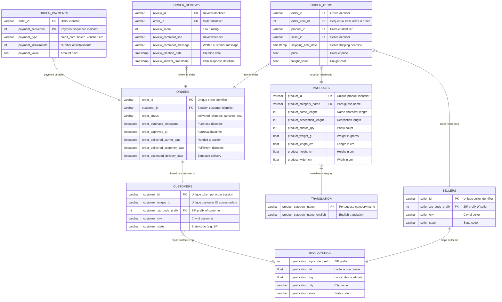

# MetricMind – Agentic Semantic BI Engine
## Dataset Documentation

This document describes the structure, relationships, business meanings, data quality findings, and modeling architecture for the **Olist Brazilian E-Commerce Dataset** stored inside `datasets/raw/`.

---

## 1. Entity-Relationship Diagram (ERD)

The following schema maps the relational links across the nine core tables. 

---

## 2. Table Documentation & Metadata

### 2.1. `olist_customers_dataset.csv`
- **Purpose**: Tracks customer identities, contact registration codes, and geographic locations.
- **Business Description**: Maps transaction-specific customer IDs (which tie to an order) to unique customer IDs that span multiple transactions over time.
- **Data Shape**: **99,441 Rows** | **5 Columns**
- **Primary Key**: `customer_id`
- **Foreign Keys**: `customer_zip_code_prefix` -> `olist_geolocation_dataset.geolocation_zip_code_prefix`
- **Relationships**:
  - `olist_customers_dataset` (1) ➔ (1) `olist_orders_dataset` via `customer_id`
  - `olist_customers_dataset` (N) ➔ (1) `olist_geolocation_dataset` via `customer_zip_code_prefix`
- **Important Columns & Business Meanings**:
  - `customer_id`: Unique identifier created for a specific purchase checkout session.
  - `customer_unique_id`: Persistent key that identifies the unique customer profile (used for customer retention / frequency calculations).
  - `customer_zip_code_prefix`: First five digits of the customer ZIP code.
  - `customer_city`: City name where the customer reside.
- **Example Records**:
  | customer_id | customer_unique_id | customer_zip_code_prefix | customer_city | customer_state |
  | :--- | :--- | :--- | :--- | :--- |
  | `06b8999e2fba1a1fbc...` | `861eff4711a542e4...` | `14409` | `franca` | `SP` |
- **Possible Data Quality Issues**:
  - Cities may have accented characters (e.g. `são paulo` vs `sao paulo`), creating string grouping issues.
- **Recommended Cleaning**: Clean string accents, force lowercase on city strings, and pad zip codes with leading zeroes if truncated to integer representation.
- **Data Modeling & Architecture Mapping**:
  - **Snowflake Table**: `ANALYTICS.RAW_CUSTOMERS`
  - **dbt Model**: `stg_customers` (casts data types), `dim_customers` (joins to geolocation coordinates).
  - **Cube Semantic Model**: Exposed as `Customers` Cube containing dimensions `city`, `state`, and `uniqueId`.

---

### 2.2. `olist_geolocation_dataset.csv`
- **Purpose**: Holds coordinates (latitude/longitude) mapped to Brazilian zip code prefixes.
- **Business Description**: Used for geographic mapping, logistics distance analysis, and regional delivery routing.
- **Data Shape**: **1,000,163 Rows** | **5 Columns**
- **Primary Key**: None. Multiple rows exist for a single zip prefix due to granular coordinate records. Primary key is composite of `(geolocation_zip_code_prefix, geolocation_lat, geolocation_lng)`.
- **Relationships**:
  - `olist_geolocation_dataset` (1) ➔ (N) `olist_customers_dataset` via `geolocation_zip_code_prefix`
  - `olist_geolocation_dataset` (1) ➔ (N) `olist_sellers_dataset` via `geolocation_zip_code_prefix`
- **Important Columns & Business Meanings**:
  - `geolocation_zip_code_prefix`: Brazilian ZIP code prefix (first 5 digits).
  - `geolocation_lat`: Precise latitude coordinate.
  - `geolocation_lng`: Precise longitude coordinate.
  - `geolocation_city`: Official city mapped to coordinates.
- **Example Records**:
  | geolocation_zip_code_prefix | geolocation_lat | geolocation_lng | geolocation_city | geolocation_state |
  | :--- | :--- | :--- | :--- | :--- |
  | `1037` | `-23.545621` | `-46.639292` | `sao paulo` | `SP` |
- **Possible Data Quality Issues**:
  - Extreme duplicates: Multiple coordinate mappings for a single ZIP prefix.
  - Lat/lng coordinates fall outside Brazil's geographic bounds due to input typos.
- **Recommended Cleaning**: Aggregate by `geolocation_zip_code_prefix` selecting the average lat/lng coordinates to ensure a unique 1-to-1 ZIP key downstream. Remove points outside valid latitudes (-34 to 6) and longitudes (-74 to -34).
- **Data Modeling & Architecture Mapping**:
  - **Snowflake Table**: `ANALYTICS.RAW_GEOLOCATION`
  - **dbt Model**: `stg_geolocation` (deduplicated ZIP prefix table using average coordinates).
  - **Cube Semantic Model**: Exposes `Location` dimension details for `Customers` and `Sellers` Cubes.

---

### 2.3. `olist_orders_dataset.csv`
- **Purpose**: Core transactional table capturing order statuses and delivery timeline milestones.
- **Business Description**: Central table of the star schema. Monitors transaction status and logistics fulfillment timestamps.
- **Data Shape**: **99,441 Rows** | **8 Columns**
- **Primary Key**: `order_id`
- **Foreign Keys**: `customer_id` -> `olist_customers_dataset.customer_id`
- **Relationships**:
  - `olist_orders_dataset` (1) ➔ (N) `olist_order_items_dataset` via `order_id`
  - `olist_orders_dataset` (1) ➔ (N) `olist_order_payments_dataset` via `order_id`
  - `olist_orders_dataset` (1) ➔ (N) `olist_order_reviews_dataset` via `order_id`
- **Important Columns & Business Meanings**:
  - `order_id`: Unique identifier for each customer checkout purchase.
  - `order_status`: Status of order lifecycle (`delivered`, `shipped`, `canceled`, `invoiced`, `processing`, `approved`, `unavailable`, `created`).
  - `order_purchase_timestamp`: Datetime when the transaction was completed by the client.
  - `order_delivered_customer_date`: Actual datetime when package reached the customer (used to calculate fulfillment duration).
  - `order_estimated_delivery_date`: Deadline date communicated to customer at checkout.
- **Example Records**:
  | order_id | customer_id | order_status | order_purchase_timestamp | order_delivered_customer_date |
  | :--- | :--- | :--- | :--- | :--- |
  | `e481f51cbdc5467...` | `9ef432eb6251297...` | `delivered` | `2017-10-02 10:56:33` | `2017-10-10 21:25:13` |
- **Possible Data Quality Issues**:
  - Null dates for approved, carrier handoff, and customer delivery for canceled/incomplete orders (normal).
  - A small subset of delivered orders are missing `order_delivered_customer_date`.
- **Recommended Cleaning**: Convert timestamp strings to SQL timestamps. Exclude orders with null delivery dates when performing logistics duration calculations.
- **Data Modeling & Architecture Mapping**:
  - **Snowflake Table**: `ANALYTICS.RAW_ORDERS`
  - **dbt Model**: `stg_orders` (timestamp conversions), `fct_orders` (merges item values, counts, and duration metrics).
  - **Cube Semantic Model**: The `Orders` Cube, serving as the central fact table containing measures `total_orders`, `average_delivery_time`, and dimensions `status`, `purchaseDate`.

---

### 2.4. `olist_order_items_dataset.csv`
- **Purpose**: Details specific products, costs, and sellers linked to each order transaction.
- **Business Description**: Operational detail table containing line item price points and shipping deadlines.
- **Data Shape**: **112,650 Rows** | **7 Columns**
- **Primary Key**: Compound key `(order_id, order_item_id)`
- **Foreign Keys**:
  - `order_id` -> `olist_orders_dataset.order_id`
  - `product_id` -> `olist_products_dataset.product_id`
  - `seller_id` -> `olist_sellers_dataset.seller_id`
- **Relationships**:
  - `olist_order_items_dataset` (N) ➔ (1) `olist_orders_dataset` via `order_id`
  - `olist_order_items_dataset` (N) ➔ (1) `olist_products_dataset` via `product_id`
  - `olist_order_items_dataset` (N) ➔ (1) `olist_sellers_dataset` via `seller_id`
- **Important Columns & Business Meanings**:
  - `order_item_id`: Incremental sequential identifier representing number of items within the same order (e.g. 1, 2, 3).
  - `price`: Purchase price of the single item in Brazilian Real (BRL).
  - `freight_value`: Shipping cost associated with that specific item.
  - `shipping_limit_date`: Seller's deadline to ship product to the logistic partner.
- **Example Records**:
  | order_id | order_item_id | product_id | seller_id | price | freight_value |
  | :--- | :--- | :--- | :--- | :--- | :--- |
  | `00010242fe8c5a6d...` | `1` | `4244733e06e7...` | `48436dade18ac...` | `58.90` | `13.29` |
- **Possible Data Quality Issues**:
  - Multiple items of the same order share identical details but have distinct sequential IDs, meaning they are multiple quantities of the same product.
- **Recommended Cleaning**: Aggregate at order level during fact-build, or keep line-level details in order item fact models. Ensure correct numeric casting to float for price and freight.
- **Data Modeling & Architecture Mapping**:
  - **Snowflake Table**: `ANALYTICS.RAW_ORDER_ITEMS`
  - **dbt Model**: `stg_order_items` (casts numbers), `fct_order_items` (combines product and seller data).
  - **Cube Semantic Model**: `OrderItems` Cube containing measures `gross_merchandise_value` (sum of price), `total_freight`, and `average_item_price`.

---

### 2.5. `olist_order_payments_dataset.csv`
- **Purpose**: Details payment methods and terms chosen for e-commerce transactions.
- **Business Description**: Captures how clients paid for orders (credit card, boleto, vouchers) and the number of payment installments.
- **Data Shape**: **103,886 Rows** | **5 Columns**
- **Primary Key**: Compound key `(order_id, payment_sequential)`
- **Foreign Keys**: `order_id` -> `olist_orders_dataset.order_id`
- **Relationships**:
  - `olist_order_payments_dataset` (N) ➔ (1) `olist_orders_dataset` via `order_id`
- **Important Columns & Business Meanings**:
  - `payment_sequential`: Order number in case of multiple payment methods used (e.g., paid with two credit cards or card + voucher).
  - `payment_type`: Payment category (`credit_card`, `boleto`, `voucher`, `debit_card`, `not_defined`).
  - `payment_installments`: Number of monthly installments chosen by user.
  - `payment_value`: Numerical value paid in BRL (which must sum up to the overall order price + freight).
- **Example Records**:
  | order_id | payment_sequential | payment_type | payment_installments | payment_value |
  | :--- | :--- | :--- | :--- | :--- |
  | `b81ef226f3fe1789...` | `1` | `credit_card` | `8` | `99.33` |
- **Possible Data Quality Issues**:
  - `not_defined` values inside `payment_type`.
  - Payment values set to 0.00 for orders where discount vouchers covered the entire cost.
- **Recommended Cleaning**: Exclude records where payment type is `not_defined` or impute them based on surrounding records. Confirm that the sum of payment values per order matches the order items cost + freight.
- **Data Modeling & Architecture Mapping**:
  - **Snowflake Table**: `ANALYTICS.RAW_ORDER_PAYMENTS`
  - **dbt Model**: `stg_order_payments` (cleans invalid types), `fct_order_payments` (aggregates values by order ID).
  - **Cube Semantic Model**: `OrderPayments` Cube with dimensions `paymentType` and measures `total_payments_value`.

---

### 2.6. `olist_order_reviews_dataset.csv`
- **Purpose**: Records customer satisfaction, rating scores, and text reviews.
- **Business Description**: Holds quantitative rating stars (1-5) and qualitative text commentary left by customers.
- **Data Shape**: **99,224 Rows** | **7 Columns**
- **Primary Key**: `review_id` contains duplicates (98,410 unique values). Primary key is the composite key of `(review_id, order_id)`.
- **Foreign Keys**: `order_id` -> `olist_orders_dataset.order_id`
- **Relationships**:
  - `olist_order_reviews_dataset` (N) ➔ (1) `olist_orders_dataset` via `order_id`
- **Important Columns & Business Meanings**:
  - `review_score`: Customer feedback rating rating from 1 to 5.
  - `review_comment_title`: Short text title of customer review (highly null - 88.3%).
  - `review_comment_message`: Long text message description of review (highly null - 58.7%).
  - `review_creation_date`: Date the survey invitation was sent to the customer.
  - `review_answer_timestamp`: Timestamp when the customer completed the survey.
- **Example Records**:
  | review_id | order_id | review_score | review_comment_title | review_comment_message |
  | :--- | :--- | :--- | :--- | :--- |
  | `7bc2406110b9...` | `73fc7af87114b39...` | `4` | `recomendo` | `Recebi bem antes do prazo.` |
- **Possible Data Quality Issues**:
  - Extremely high null percentage for comment title and message.
  - Multiple order reviews submitted under a single survey review ID.
- **Recommended Cleaning**: Impute null comment strings with blank characters (`''`). Convert review creation and answer dates to valid timestamp columns.
- **Data Modeling & Architecture Mapping**:
  - **Snowflake Table**: `ANALYTICS.RAW_ORDER_REVIEWS`
  - **dbt Model**: `stg_order_reviews`, `dim_reviews`.
  - **Cube Semantic Model**: `OrderReviews` Cube exposing measures `average_review_score`, `total_reviews_count`, and dimensions `reviewScore`.

---

### 2.7. `olist_products_dataset.csv`
- **Purpose**: Dimensional catalog containing details for all products sold.
- **Business Description**: Contains parameters for physical attributes, photos, and categories.
- **Data Shape**: **32,951 Rows** | **9 Columns**
- **Primary Key**: `product_id`
- **Foreign Keys**: `product_category_name` -> `product_category_name_translation.product_category_name`
- **Relationships**:
  - `olist_products_dataset` (1) ➔ (N) `olist_order_items_dataset` via `product_id`
  - `olist_products_dataset` (N) ➔ (1) `product_category_name_translation` via `product_category_name`
- **Important Columns & Business Meanings**:
  - `product_id`: Unique identifier for each product.
  - `product_category_name`: Main category class name in Portuguese.
  - `product_photos_qty`: Number of images showing the product details on the catalog page.
  - `product_weight_g`: Weight in grams (useful for shipping rate validations).
- **Example Records**:
  | product_id | product_category_name | product_photos_qty | product_weight_g | product_length_cm |
  | :--- | :--- | :--- | :--- | :--- |
  | `1e9e8ef04dbcff4...` | `perfumaria` | `1.0` | `225.0` | `16.0` |
- **Possible Data Quality Issues**:
  - 610 records have null values for `product_category_name`, descriptions, and attributes.
  - Dimensional values (weight, length, width, height) have 2 null rows.
- **Recommended Cleaning**: Coalesce null `product_category_name` values to `outro` (Portuguese for 'other'). Drop or average-impute physical dimensions.
- **Data Modeling & Architecture Mapping**:
  - **Snowflake Table**: `ANALYTICS.RAW_PRODUCTS`
  - **dbt Model**: `stg_products` (handles NULLs), `dim_products` (joins category translation mapping to get English names).
  - **Cube Semantic Model**: `Products` Cube exposing dimensions `category` (English name), `id`, and measures `total_product_count`.

---

### 2.8. `olist_sellers_dataset.csv`
- **Purpose**: Directory of active sellers operating on the Olist marketplace.
- **Business Description**: Holds seller registry identities, their local operational cities, states, and zip zones.
- **Data Shape**: **3,095 Rows** | **4 Columns**
- **Primary Key**: `seller_id`
- **Foreign Keys**: `seller_zip_code_prefix` -> `olist_geolocation_dataset.geolocation_zip_code_prefix`
- **Relationships**:
  - `olist_sellers_dataset` (1) ➔ (N) `olist_order_items_dataset` via `seller_id`
  - `olist_sellers_dataset` (N) ➔ (1) `olist_geolocation_dataset` via `seller_zip_code_prefix`
- **Important Columns & Business Meanings**:
  - `seller_id`: Unique registration token matching an active merchant.
  - `seller_zip_code_prefix`: 5-digit ZIP code locating the merchant warehouse.
  - `seller_city`: City location of the merchant.
  - `seller_state`: State code of the merchant.
- **Example Records**:
  | seller_id | seller_zip_code_prefix | seller_city | seller_state |
  | :--- | :--- | :--- | :--- |
  | `3442f8959a84d...` | `13023` | `campinas` | `SP` |
- **Possible Data Quality Issues**:
  - Mismatch between zip code city and recorded seller city due to spelling or state border discrepancies.
- **Recommended Cleaning**: Clean string capitals and replace special character formats. Verify that the ZIP code falls within the corresponding state code.
- **Data Modeling & Architecture Mapping**:
  - **Snowflake Table**: `ANALYTICS.RAW_SELLERS`
  - **dbt Model**: `stg_sellers`, `dim_sellers` (joins geography coordinates).
  - **Cube Semantic Model**: `Sellers` Cube containing dimensions `city`, `state`, and measures `total_sellers`.

---

### 2.9. `product_category_name_translation.csv`
- **Purpose**: Translation mapping translating Portuguese category definitions to English equivalents.
- **Business Description**: Facilitates UI presentation and querying in English, ensuring compatibility for international executives.
- **Data Shape**: **71 Rows** | **2 Columns**
- **Primary Key**: `product_category_name`
- **Relationships**:
  - `product_category_name_translation` (1) ➔ (N) `olist_products_dataset` via `product_category_name`
- **Important Columns & Business Meanings**:
  - `product_category_name`: Key name string in Portuguese (used in products dataset).
  - `product_category_name_english`: Value name string in English (used for reporting).
- **Example Records**:
  | product_category_name | product_category_name_english |
  | :--- | :--- |
  | `beleza_saude` | `health_beauty` |
- **Possible Data Quality Issues**:
  - Missing translations: Some categories present in the products dataset (e.g. `pc_gamer`, `portateis_cozinha_e_preparadores_de_alimentos`) do not exist in this translation dictionary.
- **Recommended Cleaning**: Provide hardcoded manual fallback maps for missing category translations inside the dbt layer (e.g. mapping `pc_gamer` to `pc_gamer` or `gaming_pcs`).
- **Data Modeling & Architecture Mapping**:
  - **Snowflake Table**: `ANALYTICS.RAW_CATEGORY_TRANSLATION`
  - **dbt Model**: `stg_category_translation` (used inside `dim_products` lookup join).
  - **Cube Semantic Model**: Joined internally in `Products` Cube to export English names.
