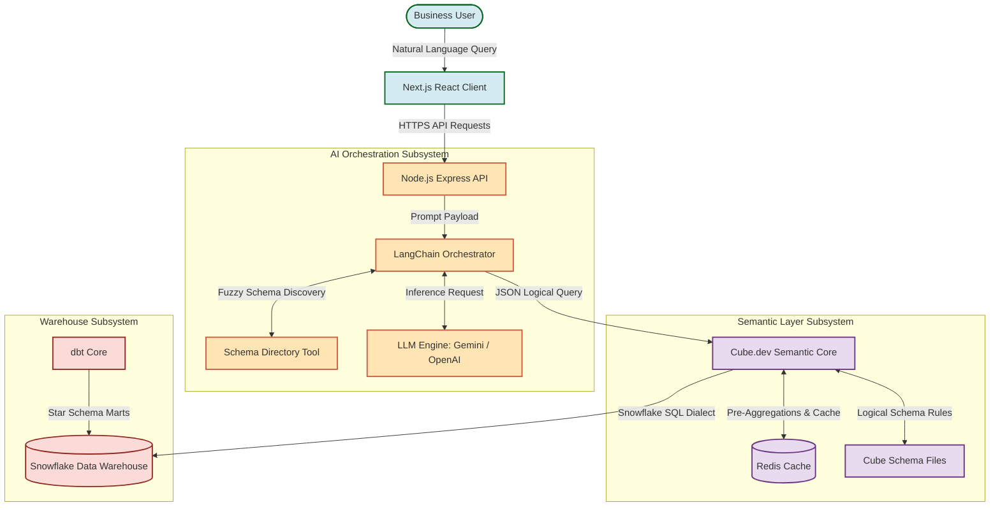
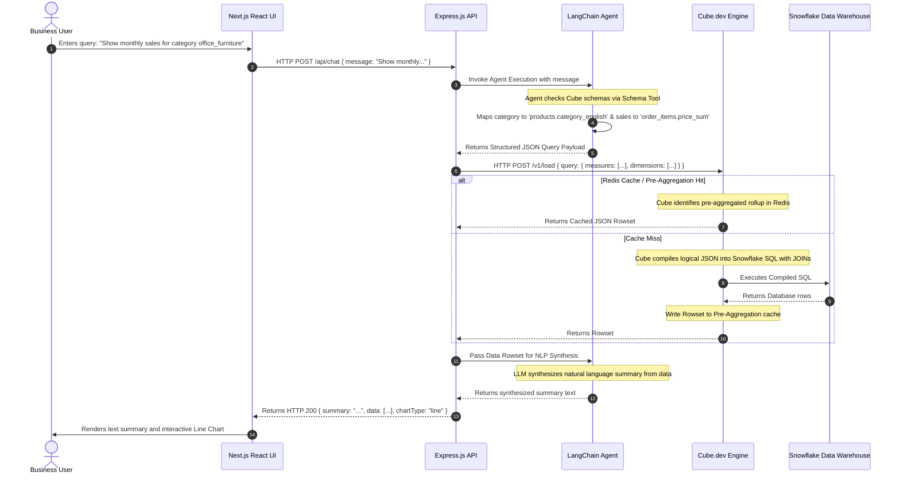
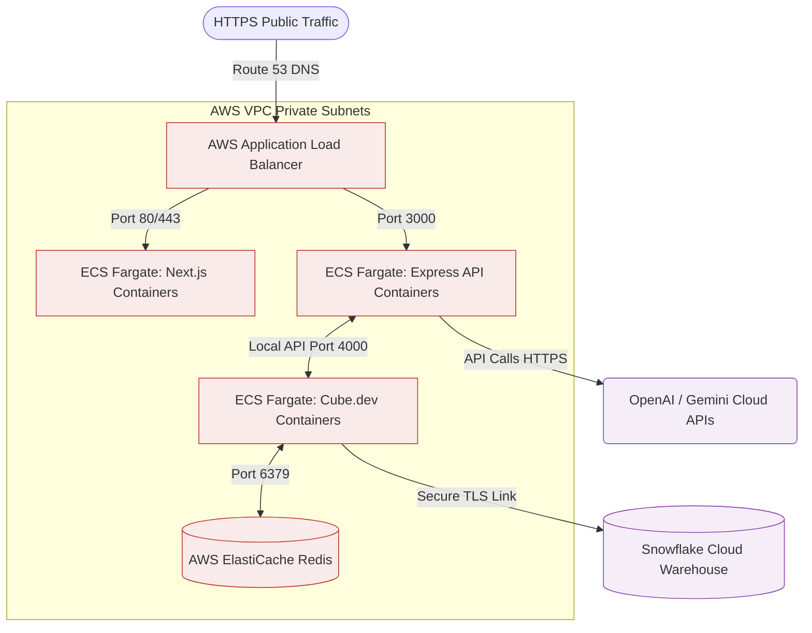

# MetricMind – Agentic Semantic BI Engine
## System Architecture Document

This document provides a comprehensive blueprint of the system architecture for **MetricMind**, detailing component configurations, architectural principles, request lifecycles, and deployment models.

---

## 1. Architecture Overview
MetricMind is built on a **Semantic-First Agentic Architecture**. Instead of allowing the Large Language Model (LLM) to write raw SQL commands directly to the database, the LLM interacts exclusively with a logical **Semantic Layer** (Cube.dev). The AI agent serves as an intelligent orchestrator, mapping natural language questions to governed dimensions and measures. Cube.dev compiles these structured requests into high-performance, validated SQL and runs it on the **Snowflake Data Warehouse**.

### High-Level Architecture Diagram
The diagram below illustrates the end-to-end user query lifecycle and the physical isolation of the data warehouse:



---

## 2. Architectural Principles & Design Decisions

### Principles
1. **Separation of Concerns**: The LLM determines the *user intent* (what metrics and filters the user wants to see), while the Semantic Layer manages the *data definition and SQL formulation* (how metrics are mathematically calculated and joined).
2. **Immutable Metric Definitions (Single Source of Truth)**: A metric like `gross_revenue` or `delivery_delay` is written once inside Cube.js/YAML files. It cannot be redefined dynamically by the AI, avoiding mathematical hallucinations.
3. **Defense in Depth**: The database credentials and underlying warehouse schemas are strictly contained within Cube.dev and Snowflake. The AI and the client applications have zero visibility into connection string parameters, tables, or database catalogs.
4. **Cache Optimality**: To protect warehouse compute budgets, all queries are intercepted by Cube’s pre-aggregation rollups and Redis cache, serving repeat questions in milliseconds.

### Design Decision Justification Matrix

| Decision Area | Selected Technology | Rejected Alternative | Core Business & Technical Rationale |
| :--- | :--- | :--- | :--- |
| **SQL Generation** | **Cube.dev Semantic Layer** | Direct Text-to-SQL (LLM writes SQL) | Direct Text-to-SQL lacks governance, frequently invents table names (hallucination), fails on complex multi-table joins, and exposes the database to severe SQL injection vulnerabilities. Cube.dev acts as a secure mathematical compiler. |
| **Data Warehousing**| **Snowflake** | Self-hosted PostgreSQL | PostgreSQL cannot scale compute dynamically to run heavy analytical aggregations over millions of rows of geolocation data. Snowflake separates compute from storage, allowing auto-suspension and auto-scaling of analytical clusters. |
| **Transformation** | **dbt (data build tool)** | Custom Python/Pandas ETL | Python script execution is difficult to orchestrate, lacks built-in data quality testing (uniqueness, referential integrity), and does not support automatic incremental modeling. dbt compiles sql models and records data lineage. |
| **Orchestration** | **LangChain Agent** | Direct OpenAI API calls | LangChain provides native Agent loop wrappers, tool definitions (allowing the model to inspect schema metadata dynamically), and structured output parser models. |

---

## 3. Technology Responsibilities

### Frontend Subsystem (Next.js & React)
- **Role**: Collects user input, manages search auto-completes, maintains client side chat histories, and renders rich charts.
- **Visuals**: Uses **Tremor** and **Apache ECharts** to dynamically render time-series line graphs, categorical bar charts, and data tables.
- **Component-Driven**: Constructed using atomic components (e.g. `ChatBubble`, `QueryInput`, `ChartRenderer`, `MetricsCard`).

### Backend Subsystem (Node.js & Express)
- **Role**: Hosts application server APIs, manages user sessions, logs interactions, and acts as the gatekeeper between the client UI and the LangChain orchestrator.
- **Protocol**: Exposes HTTPS REST endpoints (e.g., `/api/chat`, `/api/schema`).

### AI Agent Subsystem (LangChain)
- **Role**: Parses unstructured conversational inputs into structured JSON parameters matching the semantic layer's capabilities.
- **Execution Loop**:
  1. Receives natural language question.
  2. Queries the Schema Discovery Tool to check active measures and dimensions in Cube.dev.
  3. Formulates a JSON object: `{ "measures": [...], "dimensions": [...], "timeDimensions": [...], "filters": [...] }`.
  4. Passes the JSON query to the Backend for Cube.dev dispatch.

### Semantic Layer (Cube.dev)
- **Role**: Receives structured JSON logical queries, compiles them into optimized SQL based on schema models, manages local cache stores, and submits queries to Snowflake.
- **Governance**: Configures row-level security policies (e.g., restricting seller records by region) and manages pre-aggregation tables.

### Transformation Layer (dbt)
- **Role**: Cleanses raw e-commerce records inside Snowflake and models them into a clean star schema (Facts & Dimensions).
- **Quality Control**: Executes tests (`unique`, `not_null`, `relationships`) to ensure integrity prior to semantic exposure.

### Data Warehouse (Snowflake)
- **Role**: Stores raw staging tables and transformed analytical marts. Executes columnar query aggregations.

---

## 4. Component Architecture & System Interfaces

The following component diagram illustrates the APIs and serialization formats used to transfer information between subsystems:

```mermaid
componentDiagram
    [Next.js UI] as UI
    [Express Backend] as API
    [LangChain Agent] as Agent
    [LLM (Gemini/OpenAI)] as LLM
    [Cube.dev Engine] as Cube
    [Snowflake Warehouse] as Snowflake
    
    UI <-->|JSON Payload via HTTP POST| API : "/api/query"
    API <-->|Node SDK Calls| Agent : "runAgentLoop(prompt)"
    Agent <-->|REST API / SDK| LLM : "Chat Completion / Tool Use"
    API <-->|REST Query API| Cube : "/v1/load"
    Cube <-->|JDBC/ODBC SQL Connection| Snowflake : "Execute Governed SQL"
```

---

## 5. System Data Flow & Request Lifecycle

### Request Lifecycle (Sequence Diagram)
This sequence diagram tracks the operations triggered by a user query:



### Transformation & Ingestion Pipeline Data Flow
This lineage mapping outlines the ETL pipeline transforming raw Olist CSV data into analytics-ready visual states:

```mermaid
graph LR
    %% Data Sources
    subgraph Ingestion
        RawCSV[(Raw Olist CSVs)] -->|COPY INTO / SnowSQL| SF_Raw[(Snowflake Raw Schema)]
    end
    
    %% Transformations
    subgraph dbt Transformation Marts
        SF_Raw -->|stg_orders / stg_customers| DBT_Stg[dbt Staging Models]
        DBT_Stg -->|int_order_items_joined| DBT_Int[dbt Intermediate Models]
        DBT_Int -->|fct_orders / dim_products| DBT_Marts[dbt Analytics Marts]
    end

    %% Semantic Layer
    subgraph Cube Semantic Modeling
        DBT_Marts -->|SQL Source Mapping| CubeModel[Cube Logical Models]
        CubeModel -->|Materialize rollup tables| PreAggs[Cube Pre-Aggregations]
    end
    
    %% Consumption
    subgraph Consumption Layer
        PreAggs -->|API JSON Output| WebUI[Frontend Dashboards]
    end
    
    classDef step fill:#fcf3cf,stroke:#b7950b,stroke-width:1px;
    class DBT_Stg,DBT_Int,DBT_Marts step;
```



---

## 6. Security Architecture

- **Isolation Strategy**:
  - The Next.js frontend has no network visibility or logical access to the Snowflake database.
  - The LangChain agent interacts with the metadata dictionary of Cube.dev but has no direct connection credentials to Snowflake.
- **Access Control & Permissions**:
  - **Warehouse Layer**: Snowflake uses Role-Based Access Control (RBAC). The database user assigned to Cube.dev (`CUBE_USER`) is restricted to the `ANALYTICS_READ` role, possessing read-only privileges on the `ANALYTICS.MARTS` schema.
  - **Semantic Layer**: Cube.dev exposes logical models via JWT validation. User tokens encode tenant/role parameters (e.g. `seller_id` or `state`), permitting Cube.dev to dynamically append row-level security (RLS) constraints to generated SQL queries.
- **Credentials Vault**:
  - Snowflake login passwords, database warehouse names, API keys, and OpenAI/Gemini credentials are kept out of raw code. They are loaded at runtime from a secure environment variables configuration vault (e.g., AWS Secrets Manager or local Docker `.env` files).

---

## 7. Authentication & Token Strategy (Future-Ready)

To transition from local development to an enterprise production setup, MetricMind is designed to integrate with standard identity protocols:

```
[Client Login Request] ➔ [OAuth 2.0 / OIDC Provider (Okta/Auth0)] ➔ [Access & ID Tokens] ➔ [Session Management]
```
- **Session Tokens**: Exchanged via signed Json Web Tokens (JWT) using the `RS256` encryption algorithm.
- **Payload Schema**:
  ```json
  {
    "sub": "user_12345",
    "email": "exec@olist.com.br",
    "role": "Region_Manager",
    "permissions": ["read:metrics"],
    "tenant_filter": {
      "customer_state": "SP"
    },
    "exp": 1810560000
  }
  ```
- **Semantic Propagation**: When the backend routes queries to `/v1/load`, it passes the user's JWT. Cube.dev decodes the token, validating that the user is authorized to view the requested measures, and automatically inserts state-level filter queries (e.g., `WHERE customer_state = 'SP'`).

---

## 8. Scalability & Performance

### Dynamic Storage & Compute Scaling
Snowflake separates storage and compute. The analytics data warehouse is split into two virtual warehouses:
- `TRANSFORM_WH` (Size: Medium): Runs dbt schedules during nightly batch loads. Auto-suspends after 60 seconds of inactivity to save costs.
- `ANALYTICS_WH` (Size: X-Small): Runs analytical queries triggered by Cube.dev. Leverages multi-cluster scaling to add compute nodes if concurrency increases.

### Caching Topology & Pre-Aggregations
Cube.dev manages a two-tier cache structure to reduce roundtrips to Snowflake:
1. **In-Memory Cache (Redis)**: Caches query results for 5 minutes. If identical questions are asked, the response is immediate.
2. **Pre-Aggregations (Rollup Tables)**: Materialized tables containing pre-computed metrics (e.g., sales grouped by category and month) generated inside Snowflake. When a query is received, Cube.dev maps the query to the pre-aggregation rollup rather than aggregating raw transactional order rows, reducing query execution time from several seconds to under 500 milliseconds.

---

## 9. Fault Tolerance & Resilience

- **Retry Policies**: The backend utilizes exponential backoff retry algorithms when communicating with external LLM endpoints (OpenAI/Gemini APIs) to handle transient network issues or rate limits.
- **Graceful Fallbacks**:
  - *LLM Timeout*: If the AI orchestration layer fails to respond within 10 seconds, the system falls back to a template-based lookup system or returns a standard response asking the user to try again.
  - *Cube.dev Unavailability*: If the semantic engine goes offline, the backend redirects queries to a local fallback cache of static metrics or displays a maintenance notification.
- **Query Complexity Guardrails**: Cube.dev limits query execution budgets. If a query requests data volumes exceeding safety bounds, the request is terminated to avoid warehouse compute locks.

---

## 10. Logging, Monitoring, & Telemetry

- **Structured Auditing**: All API inputs and outputs are structured as JSON and written to centralized log streams (e.g. AWS CloudWatch or Elastic ELK). Logs include: `timestamp`, `session_id`, `input_text`, `mapped_semantic_query`, `sql_query`, `latency_ms`, and `status`.
- **OpenTelemetry Standard**: Distributed tracing follows the OpenTelemetry specification, tracking the latency of requests as they flow from the API gateway down to Snowflake.
- **System Metrics**: Prometheus agents monitor active memory, CPU usage, and queue rates for Node.js containers, while Grafana displays latency dashboards and API error rates.

---

## 11. Deployment Architecture

### Deployment Topology Diagram
This diagram outlines the physical deployment of MetricMind components inside a containerized cloud host (AWS):



### Local vs Production Environments
- **Local Dev**: Configured using Docker Compose (`docker-compose.yml`), spinning up Next.js, Express, Cube.dev, and Redis containers on a shared local network.
- **Production Target**: Deploy containerized microservices to AWS ECS Fargate, scaling containers automatically based on CPU and request volumes. Redis is managed through AWS ElastiCache, and Snowflake runs in the same cloud region to minimize query latencies.
