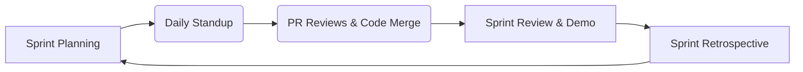
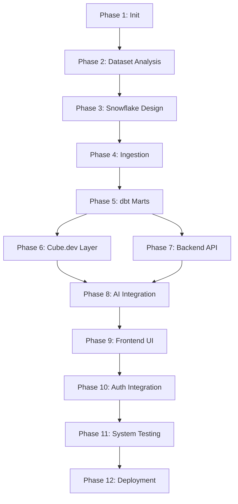
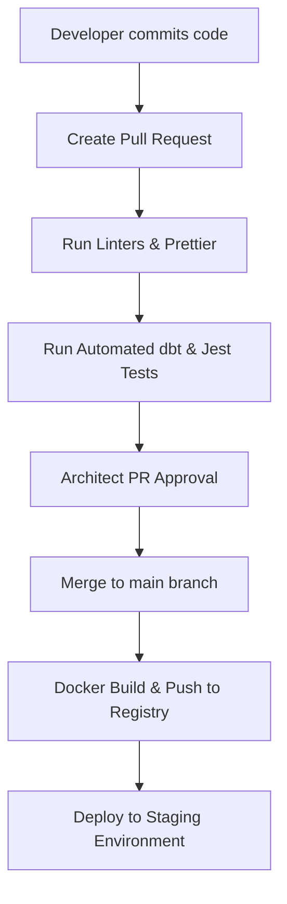

# MetricMind – Agentic Semantic BI Engine
## Project Implementation Roadmap

This document outlines the execution roadmap for **MetricMind**, establishing Agile sprint timelines, resource allocation guidelines, phase dependencies, and testing gates for a five-member engineering team.

---

## 1. Team Composition & Resource Allocation

The project implementation is structured around a dedicated five-member engineering team:

- **Enterprise Data Architect (EDA)**: Oversees relational schemas, role authorizations, Snowflake data clustering policies, and logical interface mappings.
- **Data Engineer (DE)**: Manages pipelines, coordinates Snowflake imports, and builds dbt transformation stages.
- **Analytics Engineer (AE)**: Configures dbt marts, tests metrics definitions, and develops Cube.dev semantic logical schemas.
- **Backend / AI Engineer (BE)**: Code base Express.js services, implements LangChain orchestration agents, and manages LLM prompts.
- **Frontend Developer (FE)**: Develops the Next.js React client, builds chat wrappers, and integrates dynamic visualizations.

---

## 2. Project Timeline & Sprints Overview

The project is executed across **6 Sprints of 2 weeks each** (12 weeks total duration). 

### Project Gantt Timeline
The following Gantt chart maps the scheduling and concurrence of the implementation phases:

```mermaid
gantt
    title MetricMind Project Timeline (12 Weeks)
    dateFormat  W
    axisFormat  W%W
    
    section Foundation (Sprint 1)
    Phase 1: Project Initialization      :active, p1, 1, 1w
    Phase 2: Dataset Analysis           :active, p2, 1, 1w
    Phase 3: Snowflake Warehouse Design :active, p3, 1w, 1w
    Phase 4: Data Ingestion             :active, p4, 2, 1w
    
    section Modeling (Sprint 2)
    Phase 5: dbt Transformations       :p5, 3, 2w
    
    section Semantics & API (Sprint 3)
    Phase 6: Cube.dev Semantic Layer    :p6, 5, 2w
    Phase 7: Backend Development        :p7, 5, 2w
    
    section AI Integration (Sprint 4)
    Phase 8: AI Integration             :p8, 7, 2w
    
    section Frontend UI (Sprint 5)
    Phase 9: Frontend Development       :p9, 9, 2w
    
    section Release (Sprint 6)
    Phase 10: Authentication            :p10, 11, 1w
    Phase 11: System Testing            :p11, 11, 1w
    Phase 12: Cloud Deployment          :p12, 12, 1w
```

---

## 3. Sprint Workflows & Lifecycle Rules

### Sprint Workflow
Each 2-week iteration follows a standard Scrum loop:



### Dependency Flow Diagram
The flowchart below maps the critical path. A phase cannot begin until its dependencies are resolved:



---

## 4. Phase-by-Phase Technical Breakdown

---

### Phase 1: Project Initialization
- **Objectives**: Initialize base Git repository, construct container configurations, and align tools parameters.
- **Estimated Timeline**: Week 1 (Days 1–3)
- **Dependencies**: None.
- **Assigned Resources**: EDA (Lead), BE.
- **Tasks**:
  1. Initialize monorepo directory layout.
  2. Setup Docker configurations (`Dockerfile`, `.dockerignore`) for backend, frontend, and semantic subfolders.
  3. Formulate system guidelines and establish commit conventions.
- **Deliverables**: Docker configurations for development environments.
- **Definition of Done**: Docker containers compile and run locally.
- **Risks**: Node/Docker version mismatches.
- **Risk Mitigation**: Standardize Docker base images on active LTS releases.
- **Expected GitHub Commit Milestones**:
  - `feat(infra): initialize repository structure and base docker compose configuration`

---

### Phase 2: Dataset Analysis
- **Objectives**: Confirm schema column types and review raw CSV structures to prevent mapping errors.
- **Estimated Timeline**: Week 1 (Days 3–5)
- **Dependencies**: Phase 1.
- **Assigned Resources**: EDA (Lead), DE.
- **Tasks**:
  1. Verify completeness of raw CSV files inside `datasets/raw/`.
  2. Check for null values, duplicates, and string encodings (UTF-8).
  3. Validate relation keys (e.g., matching customer zip codes to geolocation prefixes).
- **Deliverables**: Verification metrics report.
- **Definition of Done**: Schema anomalies documented in project dashboard.
- **Risks**: Corrupted CSV parsing errors due to special characters.
- **Risk Mitigation**: Pre-process CSV files using encoding filters (e.g., ISO-8859-1 checks).
- **Expected GitHub Commit Milestones**:
  - `docs(datasets): document raw schemas and metadata anomalies`

---

### Phase 3: Snowflake Warehouse Design
- **Objectives**: Establish schemas, assign access privileges, and set auto-suspend timers.
- **Estimated Timeline**: Week 1 (Days 5–7)
- **Dependencies**: Phase 2.
- **Assigned Resources**: EDA (Lead), DE.
- **Tasks**:
  1. Author database script `database_setup.sql`.
  2. Define raw staging and analytical marts schemas (`RAW`, `MARTS`).
  3. Establish functional database roles (`ANALYTICS_READ`, `ANALYTICS_WRITE`).
- **Deliverables**: Snowflake DDL configuration scripts.
- **Definition of Done**: Warehouse cluster is active and credentials verify.
- **Risks**: Auto-scaling warehouses run up excessive billing.
- **Risk Mitigation**: Set auto-suspend limits to 60 seconds of inactivity.
- **Expected GitHub Commit Milestones**:
  - `feat(snowflake): create warehouse setups and role definitions DDL`

---

### Phase 4: Data Ingestion
- **Objectives**: Populate Snowflake raw staging tables with CSV files.
- **Estimated Timeline**: Week 2 (Days 8–10)
- **Dependencies**: Phase 3.
- **Assigned Resources**: DE (Lead), EDA.
- **Tasks**:
  1. Upload raw CSV datasets to cloud storage staging buckets (e.g., AWS S3).
  2. Write copy scripts (`copy_commands.sql`) using Snowflake commands.
  3. Establish data loading pipelines.
- **Deliverables**: Ingested data tables inside `ANALYTICS.RAW`.
- **Definition of Done**: Raw row counts match CSV record sizes.
- **Risks**: Data type casting mismatches during bulk load.
- **Risk Mitigation**: Import raw columns as VARCHAR and cast within downstream staging models.
- **Expected GitHub Commit Milestones**:
  - `feat(ingest): implement copy commands script for CSV bulk upload`

---

### Phase 5: dbt Transformations
- **Objectives**: Model staging fields into a star schema (Facts & Dimensions) and execute data validation tests.
- **Estimated Timeline**: Weeks 3–4 (Days 11–20)
- **Dependencies**: Phase 4.
- **Assigned Resources**: DE (Lead), AE.
- **Tasks**:
  1. Configure `dbt_project.yml`.
  2. Create staging SQL models (`stg_orders`, `stg_customers`, etc.) to clean data types and remove accents.
  3. Author analytics models (`fct_orders`, `dim_products`).
  4. Write automated dbt integrity checks.
- **Deliverables**: Transformed dbt models inside Snowflake.
- **Definition of Done**: Models build successfully and validation tests return zero errors.
- **Risks**: Circular dependencies in dbt DAG configurations.
- **Risk Mitigation**: Enforce standard modular layering (Staging ➔ Intermediate ➔ Marts).
- **Expected GitHub Commit Milestones**:
  - `feat(dbt): create staging models and transform schema mapping`
  - `feat(dbt): deploy dimensional marts and run schema testing checks`

---

### Phase 6: Cube.dev Semantic Layer
- **Objectives**: Map transactional schemas to semantic definitions, establishing pre-aggregations.
- **Estimated Timeline**: Weeks 5–6 (Days 21–30)
- **Dependencies**: Phase 5.
- **Assigned Resources**: AE (Lead), EDA.
- **Tasks**:
  1. Define database connections inside `cube.js`.
  2. Map YAML logical cubes (Measures: Sum, Average; Dimensions: categories, date).
  3. Write performance pre-aggregations rollups to optimize common queries.
- **Deliverables**: Governing schemas in the `cube/` directory.
- **Definition of Done**: Logical measures compile correctly inside Cube sandbox.
- **Risks**: Slow query responses on non-aggregated categories.
- **Risk Mitigation**: Schedule daily pre-aggregation rebuilds.
- **Expected GitHub Commit Milestones**:
  - `feat(cube): configure cube server and define semantic measures schemas`

---

### Phase 7: Backend Development
- **Objectives**: Build Express API routes, interface with Cube.dev, and implement session logs.
- **Estimated Timeline**: Weeks 5–6 (Days 21–30)
- **Dependencies**: Phase 5.
- **Assigned Resources**: BE (Lead).
- **Tasks**:
  1. Author server setup routes `/api/chat` and `/api/schema` in Express.
  2. Integrate Cube.dev Node SDK calls.
  3. Add request validation rules.
- **Deliverables**: Functional backend API routes.
- **Definition of Done**: Node server returns JSON metrics payloads.
- **Risks**: Session state leaks across concurrent requests.
- **Risk Mitigation**: Design routes as stateless services, routing parameters through requests.
- **Expected GitHub Commit Milestones**:
  - `feat(backend): initialize express server structure and routing endpoints`

---

### Phase 8: AI Integration
- **Objectives**: Construct LangChain agent orchestrator, define discovery tools, and write system prompts.
- **Estimated Timeline**: Weeks 7–8 (Days 31–40)
- **Dependencies**: Phase 6, Phase 7.
- **Assigned Resources**: BE (Lead), AE.
- **Tasks**:
  1. Define LangChain Agent executor configurations.
  2. Implement metadata schema parser tool.
  3. Implement prompt formatting templates and structured JSON parsing logic.
- **Deliverables**: LangChain agent interface module.
- **Definition of Done**: User text translates consistently into valid Cube JSON queries.
- **Risks**: LLM attempts to generate SQL directly instead of JSON queries.
- **Risk Mitigation**: Restrict model tools to schema lookups and enforce JSON validation.
- **Expected GitHub Commit Milestones**:
  - `feat(ai): integrate langchain agent loop and prompt template parameters`

---

### Phase 9: Frontend Development
- **Objectives**: Construct UI screens, implement chat widgets, and integrate responsive charts.
- **Estimated Timeline**: Weeks 9–10 (Days 41–50)
- **Dependencies**: Phase 8.
- **Assigned Resources**: FE (Lead).
- **Tasks**:
  1. Scaffolding Next.js directory tree.
  2. Implement chat UI components and markdown parser.
  3. Integrate Dynamic Chart components (Tremor/ECharts).
- **Deliverables**: Next.js client application.
- **Definition of Done**: UI renders query text summaries and visual data graphs.
- **Risks**: Browser memory leaks due to large dataset rendering.
- **Risk Mitigation**: Paginate large tables and limit visualization points to top 50 rows.
- **Expected GitHub Commit Milestones**:
  - `feat(frontend): scaffold nextjs workspace and build search components`
  - `feat(frontend): integrate tremor graphs and format chart rendering logic`

---

### Phase 10: Authentication
- **Objectives**: Restrict route queries using secure JWT access.
- **Estimated Timeline**: Week 11 (Days 51–54)
- **Dependencies**: Phase 9.
- **Assigned Resources**: BE (Lead), FE.
- **Tasks**:
  1. Configure Auth0/Okta integrations in backend middleware.
  2. Implement login screens in Next.js client.
  3. Route credentials through JWT token validation hooks.
- **Deliverables**: Secure login authentication flows.
- **Definition of Done**: Unauthenticated requests are blocked.
- **Risks**: JWT validation fails during token expiration events.
- **Risk Mitigation**: Use standard library verification middlewares with auto-refresh hooks.
- **Expected GitHub Commit Milestones**:
  - `feat(auth): integrate oauth configuration and secure backend routes`

---

### Phase 11: System Testing
- **Objectives**: Run end-to-end user validation and execute load testing checks.
- **Estimated Timeline**: Week 11 (Days 54–57)
- **Dependencies**: Phase 10.
- **Assigned Resources**: FE (Lead), BE, AE.
- **Tasks**:
  1. Author integration tests (`Playwright`/`Jest`).
  2. Run simulation queries to audit LLM parsing reliability.
  3. Perform performance audits to verify latency constraints.
- **Deliverables**: System testing suite reports.
- **Definition of Done**: 100% of integration checks return success.
- **Risks**: LLM changes alter query mapping parameters.
- **Risk Mitigation**: Lock LLM API versions to stable model releases.
- **Expected GitHub Commit Milestones**:
  - `test(e2e): implement Playwright user flows and performance latency tests`

---

### Phase 12: Cloud Deployment
- **Objectives**: Build production images, configure AWS networking, and launch containers.
- **Estimated Timeline**: Week 12 (Days 58–60)
- **Dependencies**: Phase 11.
- **Assigned Resources**: EDA (Lead), DE.
- **Tasks**:
  1. Write production Docker Compose configurations.
  2. Setup AWS ECS Fargate cluster routing.
  3. Configure cloud security boundaries.
- **Deliverables**: Operational production platform.
- **Definition of Done**: Application is live via cloud load balancer.
- **Risks**: Network configuration errors block database connectivity.
- **Risk Mitigation**: Allow secure warehouse ingress through specific IP white-lists.
- **Expected GitHub Commit Milestones**:
  - `feat(deploy): write staging production docker configuration scripts`

---

## 5. Development Lifecycle & Release Strategy

The development pipeline implements strict code quality gates:


- **Code Merging**: No commits are allowed directly to the `main` branch. All modifications must arrive via Pull Requests.
- **Quality Checks**: PR approvals require 2 engineering reviews and passing status on all dbt test checks.
